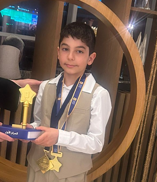

# Ibn Battuta Arabic Centre Ltd

# Online Arabic Lessons Children & Adults

✅ British-based methods for teaching Arabic for both native and non-native speakers

✅ One-to-one lessons at group rates

✅ Operating in the UK and Dubai

🎁 First lesson free

📲 [WhatsApp us](https://wa.me/447775241717)

{fig-align="center"}

✅ Congratulations to Nejm Eddin Rasheid Nama – 1st Place Winner of the 2025 Arabic Reading Challenge (UK Level) which held in Doubai.

### Our Courses

### Children’s Courses

✅ All lessons are online and one-to-one, ensuring high quality and steady progress

✅ Standard programme: 2 hours per week for 3 years — guiding children from beginner to confident Arabic users

✅ British-based teaching methods with interactive and engaging activities

✅ Bespoke learning materials and a free online subscription are a gift to all new students

✅ Our current students are able to participate confidently in the Arabic Reading Challenge after completing the standard programme

📍 United Kingdom: £80 per month

📍 Dubai: AED 400 per month 

🎁 First lesson free

📲 [WhatsApp us](https://wa.me/447775241717)

### Adult Courses

✅ All lessons are online, with two flexible options:

-   One-to-one lessons

-   Small group evening courses

✅ Standard evening group course: 18 hours per level, 2 hours per week

✅ British-based teaching methods with interactive and engaging activities

✅ Bespoke learning materials are provided to all students

**One-to-One Lessons (2 hours/week)**

📍United Kingdom: £160 per month

📍Dubai: AED 800 per month

**Standard Evening Group Course**

📍United Kingdom: £120 per level (18 hours)

📍Dubai: AED 600 per level

🎁 First lesson free

📲 [WhatsApp us](https://wa.me/447775241717)

© 2026 Ibn Battuta Ltd. All rights reserved.
